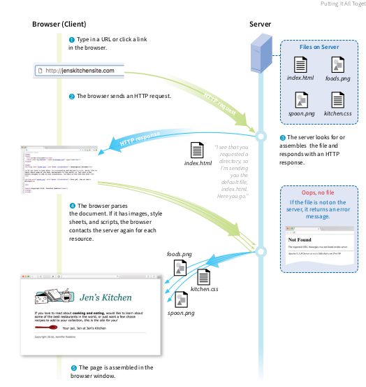
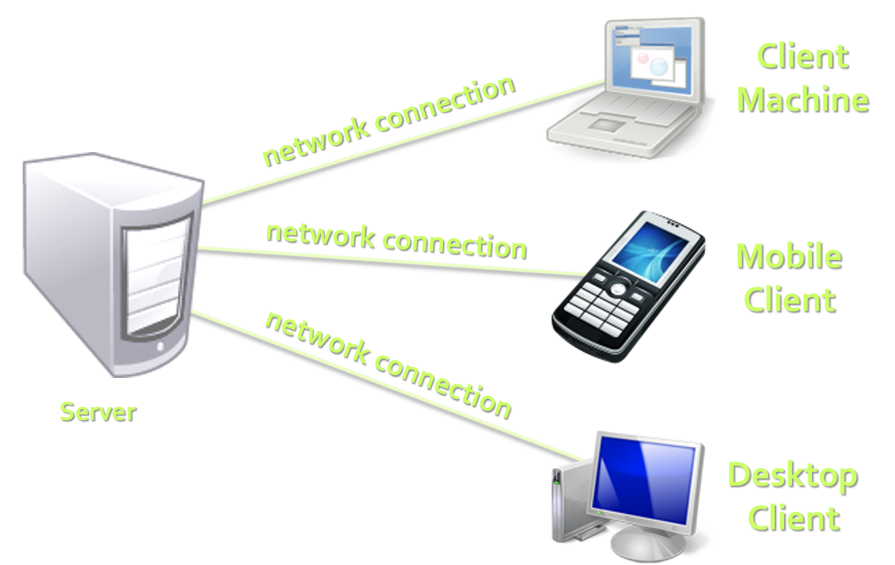

# Basics
## Concepts

# Table of Contents
- [How the Web works](#/webworks)
- [Web Sites and Web Applications](#/web)
- [Web Browsers](#/browsers)
- [Hardware Servers](#/hardwareserver)
- [Web Servers](#/webserver)
- [Client-Server Architecture](#/clientserver)
- [Cloud](#/cloud)

# <a id="webworks"></a>How the web works





[View PDF](./how-web-works.pdf)

# Web Page

- Web Pages
  - Are **documents** or **information resources** that are suitable for the World Wide Web
  - Can be accessed through a **web browser** and displayed on a monitor or a mobile device
  - This information is usually in `HTML` or `XHTML` format, and may provide navigation to other web pages via **hypertext links**
  - Web pages frequently refer to other resources such as **style sheets** (`CSS`), **scripts** (`JavaScript`) and **images** into their final presentation


# <a id="web"></a>Web Site

- Web Sites
  - Are **collections** of related web pages containing web resources (web pages, images, videos, CSS files, JS files or other digital assets)
  - Have **common navigation** between web pages
  - Are **hosted** on at least one **web server**
  - Are accessible via a  network (such as the Internet)
- **All publicly accessible websites** collectively constitute the **World Wide Web**


# Web Application

- Web Application
  - Next level web sites
  - High interactivity
  - High accessibility (Cloud)
  - AJAX, Silverlight, Flash, Flex, etc.
  - Applications are usually broken into logical chunks called "tiers", where every tier is assigned a role
  - Desktop-like application in the web browser

# <a id="browsers"></a>Web Browsers
- A Web browser is a program designed to enable users to **access**, **retrieve** and **view** documents and other resources from the Web
- Main responsibilities:
  - **Bring** information resources to the user (issuing requests to the web server and handling any results generated by the request)
  - **Present** web content (render HTML, CSS, JS)
  - **Capable of executing** applications within the same context as the document on view (Flash)


# Layout Engines
- Layout Engines are software components that **displays the formatted content** on the screen combining:
  - Marked up content (such as `HTML`, `XML`, image files, etc.)
  - Formatting information (such as `CSS`, `XSL`, etc.)
- It "paints" on the content area of a window, which is displayed on a monitor or a printer
- Typically embedded in web browsers, e-mail clients, on-line help systems or other applications that require the displaying (and editing) of web content
- The layout engine is the "heart of a browser"


# Layout Engines and Web Browsers
- **Trident**-based
  - Internet Explorer, Netscape, Maxthon, etc.
- **Gecko**-based
  - Firefox, Netscape, SeaMonkey, etc.
- **Blink**-based
  - Chrome, Opera
- **WebKit**-based
  - Safari, iOS, Maxthon, Chrome (up to v27), etc.
- **EdgeHTML** (fork of Trident)
  - Microsoft Edge


# User Agent Strings
- Identify web browsers and their version
  - History of (in)compatibility attempts
- Can have some additional information like layout engine, user's operating system, etc...

```javascript
Mozilla/5.0 (Windows NT 6.3; WOW64) AppleWebKit/537.36 (KHTML, like Gecko) Chrome/41.0.2272.118 Safari/537.36
```

  - **Mozilla/5.0** – a generic term which most modern browsers use (originally indicated Netscape)
  - **Windows NT 6.3** – Windows 8.1
  - **WOW64** – Windows-On-Windows 64-bit
  - **AppleWebKit/537.36** – Blink is a fork of WebKit
    - KHTML is the previous name of WebKit
  - **Chrome/41.0.2272.118** – real browser version
  - **Safari/537.36** – artifact against scripts sniffing


# <a id="hardwareserver"></a>Hardware Servers
- A hardware server is a **physical computer** dedicated to running one or more such services
- Servers are placed in colocation centers
  - Colocation facilities provide space, power, cooling, and physical security for the server
- The server may be:
  - Database server
  - File server
  - Mail server
  - Print server
  - VPS servers


# <a id="webserver"></a>What Do the Web Servers Do?
- All physical servers have hardware
- The hardware is controlled by the operating system
- **Web servers** are software products that use the operating  system to **handle web requests**
  - Web servers **serve Web content**
- These requests are redirected to other software products (ASP.NET, PHP, etc.), depending on the web server settings


# Web Servers Market Share December 2019
- Market share of the top million busiest sites

  - **nginx**
    - 37.77%
  - **Apache**
    - 24.36%
  - **IIS** (by Microsoft)
    - 14.59%
  - **GWS** (by Google)
    - 2.94%
- [Source](https://news.netcraft.com/archives/category/web-server-survey/)


# Client-Server Architecture
- The client-server model consists of:
  - **Clients**
    - Software applications that provide UI (front-end) to access the services at the server
    - _Examples_:
      - Web browsers
      - Desktop applications
      - HTML5 applications
      - Silverlight applications
      - ASP.NET consuming services


<!-- attr: { showInPresentation: true, hasScriptWrapper: true } -->
# The Client-Server Model




# Client-Server Model: _Examples_
- Web server (Apache, IIS) – Web browser
- FTP server (ftpd) – FTP client (FileZilla)
- EMail server (qmail) – email client (Outlook)
- SQL Server – SQL Server Management Studio
- BitTorrent Tracker – Torrent client (μTorrent)
- DNS server (bind) – DNS client (resolver)
- DHCP server (wireless router firmware) – DHCP client (mobile phone /Android DHCP client/)
- SMB server (Windows) – SMB client (Windows)


# <a id="cloud"></a>What is Cloud?
- **Cloud** ≈ multiple hardware machines combine their computing power and resources
  - Share them between multiple applications
  - To save costs and use resources more efficiently
- **Public clouds**
  - Provide computing resources on demand
    - Publicly in Internet
    - Paid or free of charge (to some limit)
  - Amazon AWS, Google App Engine, Microsoft Azure, Rackspace, PHPFog, Heroku, AppHarbor

# Cloud Computing Models
- **Infrastructure as a Service (IaaS)**
  - Virtual machines in the cloud on demand
  - Users install the OS and software they need
- **Platform as a Service (PaaS)**
  - Platform, services and APIs for developers
  - E.g. Java + JBoss + JSF + JPA + MongoDB or JavaScript + Node.js + MongoDB + RabbitMQ
- **Software as a Service (SaaS)**
  - Hosted application on demand (e.g. WordPress)
