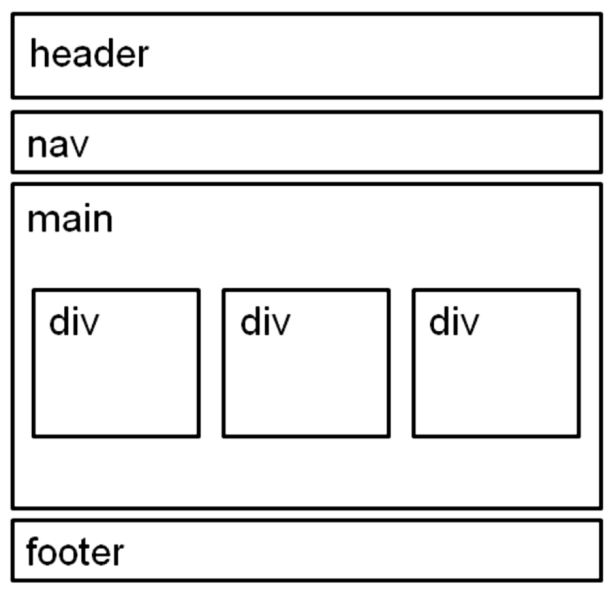

## Aim 🏹

- Get a feel for how markup works, including an   understanding of elements and attributes.
- See how browsers interpret HTML documents.
- Learn how HTML documents are structured.
- Get a first glimpse of a style sheet in action.

We will do this in the following steps 🚶 ;
  1. Start with content.
  2. Give the document structure.
  3. Identify text elements.
  4. Add an image.
  5. Change how the text looks with a style sheet.

> Continuation

- Structural elements. [Some Fundamental ideas](Fundamentals.md)

  

- [Tables](Tables.md)
- [Forms](Forms.md)

> @Credits : Learning Web Design 5th Ed (J.N. Robbins)
