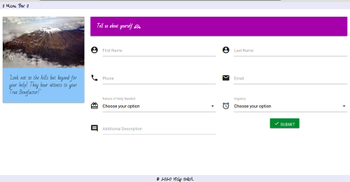

## Aim 🏹

 

- HTML Forms (Take me back 🙃 )
- Materialize
- PHP Language Introduction i
  - Syntax
  - Variables(loosely typed), Operators
  - Flow Control (Controls and iterative)
  - Processing form data i
- PHP Development Server
  - Open windows command prompt and run the following command;
  - php -S [HOST]:[PORT] e.g.php -s localhost:9000
  - > If this does not work (php not found), [then you need to add php to your windows environment  variables.](https://www.forevolve.com/en/articles/2016/10/27/how-to-add-your-php-runtime-directory-to-your-windows-10-path-environment-variable/)

#### @Credits / @References
- [PHP Logo](https://php.net/)
- [Form Icon](https://image.flaticon.com/)
- [Materialize](https://materializecss.com/about.html)
